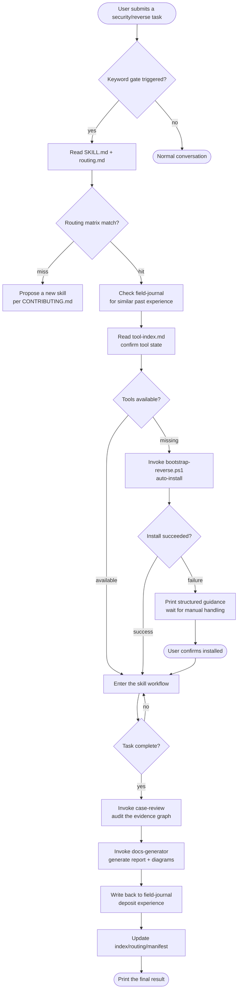
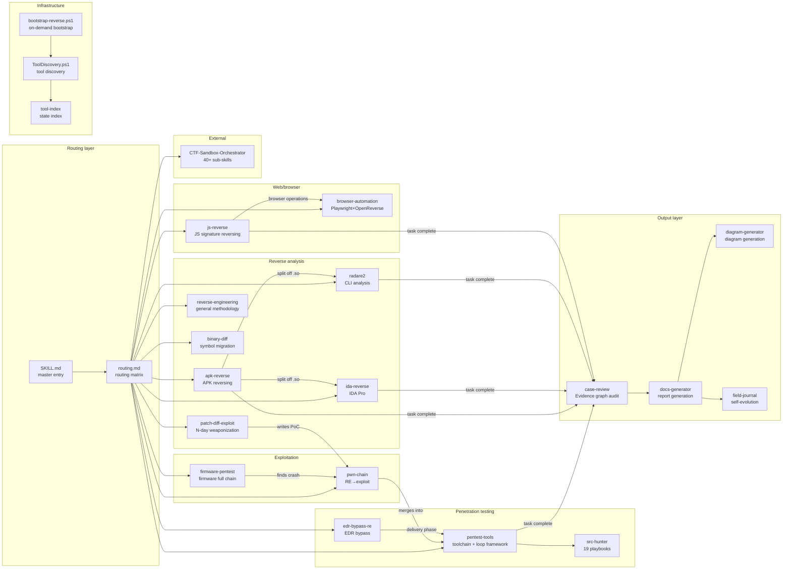
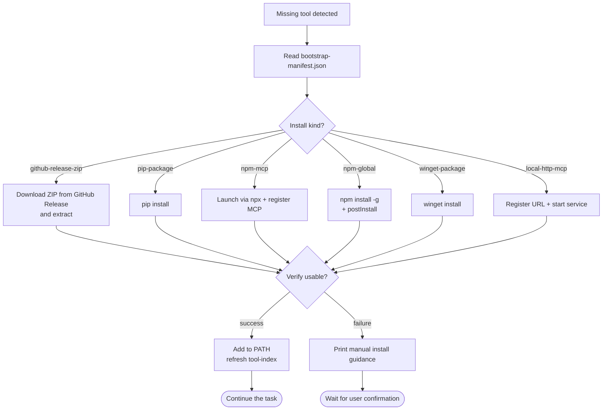
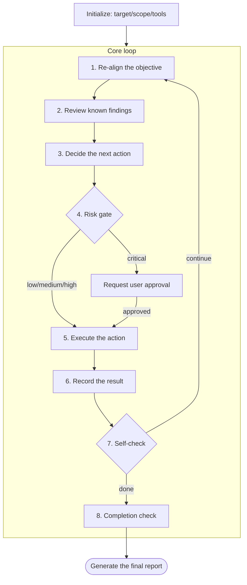
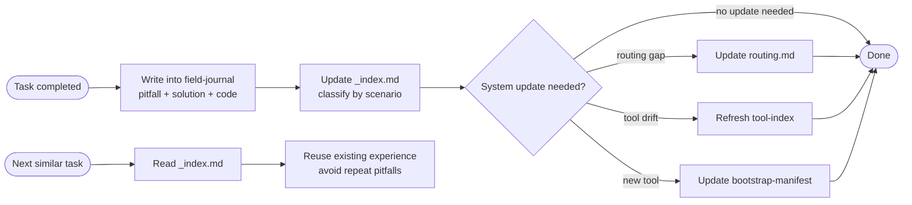
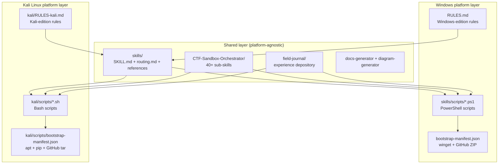
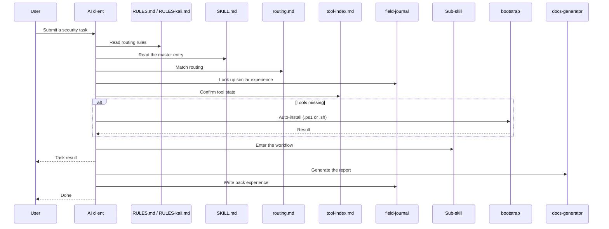

# System Architecture Diagrams

## Full behavior-chain flowchart

## Skill module relationship diagram

## Bootstrap flow

## Penetration-testing loop

## Self-evolution mechanism

## Multi-platform support architecture

### Platform selection logic

| Environment | Rules file | Scripts | Package management |
|------|--------------|-----------|--------|
| Windows | `RULES.md` | `skills/scripts/*.ps1` | winget / GitHub Release ZIP |
| Kali Linux | `kali/RULES-kali.md` | `kali/scripts/*.sh` | apt / pip / npm / GitHub tar.gz |

### Kali-edition traits

- **Many tools preinstalled**: nmap, sqlmap, hashcat, hydra, metasploit, radare2, binwalk, burpsuite, and more need no bootstrap
- **Unified apt management**: no winget, no manual ZIP extraction
- **Native bash**: simpler scripts, no PowerShell dependency
- **Path conventions**: `/usr/bin/`, `/opt/`, `~/tools/`; no drive letters or spaces-in-paths problems

## File-read sequence diagram

