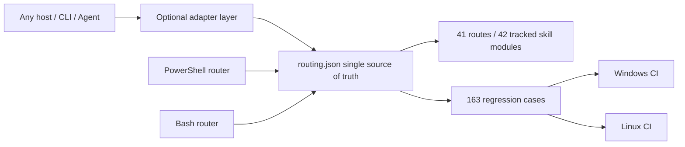

# PR #43 / #37 / #36 / #23 Local Review and Integration Report

- Date: 2026-08-08
- Baseline: `origin/main` at `6315d02`
- Review branch: `codex/review-pr-43-37-36-23`
- Scope: assess only the incremental value of the four PRs relative to the current main line; no external target actions executed
- Conclusion: all four PRs carry reusable value, but only #43 and #37 are suitable to keep in their main form; #36 and #23 must be integrated selectively

## Executive Summary

| PR | Value vs. Main Line | Integration Decision | Key Boundary |
|---|---|---|---|
| #43 | Very high | Keep structured routing, the 163-case current regression baseline, dual-platform CI, the supply-chain pin gate, and the dynamic index | Remove OpenCode configuration, installers, and dedicated agents; the core binds to no client |
| #37 | High | Merge case-review, evidence-graph review, hash verification, and unit tests, and add R40 | Accept both `done` and the currently agreed `completed` |
| #36 | Medium-high | Selectively merge Burp reconnect/newline message handling, atomic token handling, Anything Analyzer authentication, process-tree and sudo-home fixes | Reject semantic regressions such as "all capabilities unconditionally ready" |
| #23 | Medium (lower as a whole package) | Merge only Bash case-init, case-guard, structured Bash routing, and CI parity | Exclude client manifests, GIFs, presentation artifacts, and hardcoded routing copies from the 92 files |

## Platform Boundary

The single source of truth for structured routing is `skills/config/routing.json`. Both the PowerShell and Bash entry points read that file; host clients are permitted only as optional adapters and must not decide repository identity, routing rules, test baselines, or installation paths.

## Review Findings and Corrections

1. #43's design value comes from structured data and automated gates, not from OpenCode integration. All OpenCode-specific files and CI jobs were removed.
2. #37's original implementation recognized only `done` and would misreport main line's `completed` as unfinished; compatibility was added along with unit test 7.
3. #36's bridge reconnect and token writing are net gains; its capability-state rewrite would create false positives and was not merged.
4. #23's Bash router copied a hardcoded table verbatim and would immediately drift from #43's R40/priority values; it was rewritten to read `routing.json`, with R1/R3/R40 parity verified in CI.
5. The new supply-chain gate exposed 7 floating installation sources in the Kali manifest. Frida 14.10.4, the IDA MCP commit, Agent Browser 0.31.1, a ProxyCat commit, Nuclei v3.8.0, and pwntools 4.15.0 were pinned, and the install commands now actually use these pins.
6. A forced re-review after pushing found that Bash `case-init` did not inherit the CaseName path constraints; paths, control characters, wildcards, and trailing dots/spaces are now rejected, with negative CI cases added.
7. Bash's authorization URL previously fell into `offline` by mistake and could still become ready; it is now aligned with PowerShell as `authorized_target_only`, making explicit that offline accepts local samples only.
8. Bash `case-guard` now reads values only from the `auth`, `network_profile`, and `signoff` sections; pseudo-fields in notes/evidence cannot pass the gate.
9. The Kali ProxyCat pinned source install now generates a discoverable `~/.local/bin/proxycat` wrapper; the CI checkout was also pinned from a mutable tag to the v4.2.2 commit.
10. The original dynamic INDEX mistakenly included 12 `.gitignore`-excluded local modules on the development machine, so a clean clone would fail; the generator now enumerates only Git-tracked skills, and both a clean clone and a workspace with private extensions stabilize at 42 core modules.

## Quantified Improvement Over the Old Main Line

Using the same 163-case baseline, the old main line's hardcoded router and the new structured router were each invoked once per case, with every case running in an independent PowerShell process:

| Version | Passed | Accuracy | No Output |
|---|---:|---:|---:|
| Old main line `6315d02` | 137 / 163 | 84.05% | 0 |
| Current structured implementation | 163 / 163 | 100% | 0 |

An absolute gain of 26 correctly routed cases, an improvement of 15.95 percentage points. The improvement covers scenarios where the old implementation regressed to R0, including Frida/Android, certificate and root detection, capture replay, ransomware, Burp/Metasploit, Go binaries, BLE, USB, native `.so`, and memory dumps.

## Verification Results

| Verification Item | Result |
|---|---|
| Full structured-routing regression | 163 / 163 passed |
| Routing coherence and supply-chain pin gate | Passed |
| PowerShell smoke | Passed |
| P0 friction / scope-guard regression | Passed |
| Old vs. new 163-case A/B | 137/163 → 163/163 |
| case-review Python unit tests | 7 / 7 passed |
| Burp bridge Node regression | 1 / 1 passed |
| Bash router/case-init/case-guard parity | Passed |
| PowerShell, Bash syntax, and JSON parsing | Passed |
| Java compile check | The Gradle 8.7 distribution download was blocked by the machine's certificate-revocation network; switching to declared dependencies from Maven Central with JDK 21, `McpHttpServer.java` compiles |

## Remaining Risks

- Bash structured routing depends on Python 3; this is an explicit runtime dependency, but it avoids a second routing table.
- Pinned dependency versions require periodic, explicit upgrades and no longer implicitly follow `latest`.
- Client adapters can continue to be extended, but the core data and tests must remain fully host-agnostic.
- Gradle task-level testing was not completed on this machine; the cause was the 128 MB wrapper distribution download being blocked by the certificate-revocation network and a slow link. An independent compile check of the changed Java sources was completed with same-version dependencies.

## Final Recommendation

Merge the selective results of the current review branch, not the four PRs in their original whole-package form. Follow-up PRs should be split along "core routing / host adapters / presentation assets / docs" to keep independent review and rollback easy.
