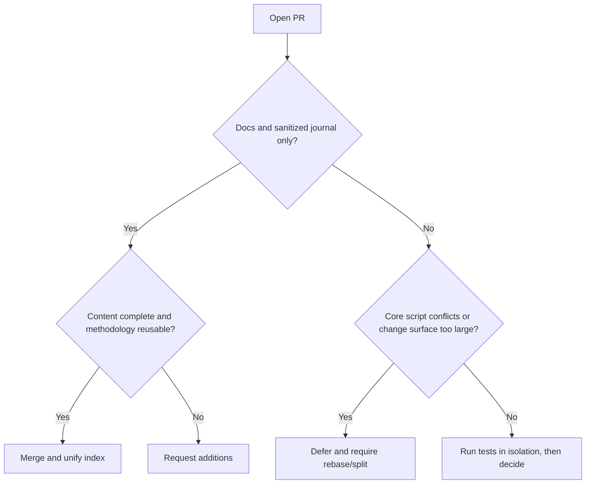

# 2026-08-08 Open PR Value Assessment and Merge Report

## Conclusion

Reviewed 8 open PRs against the latest `origin/main`. This round merged #59, #19, #22, #29; deferred #43, #37, #36, #23. Post-merge smoke and routing coherence checks both passed.

## Assessment Results

| PR | Value | Risk/Status | Decision |
|---|---|---|---|
| #59 | Rust cdylib diff-reproduction methodology is complete and highly reusable | Journal and index only, no executable code | Merge |
| #19 | Windows 24H2 toolchain compatibility coverage is broad | Journal and index only | Merge |
| #22 | Electron/Bytenode/update-chain analysis methodology is complete | Journal and index only | Merge |
| #29 | Next.js dual-API serializer and contract-rebuild experience is complete | Journal and index only | Merge |
| #43 | Routing single source of truth, regression baseline, CI, and version pinning are highly valuable; client integration must remain an optional adapter layer | 38 files, conflicts with 4 key files on main; original proposal included OpenCode-specific configuration | Defer; after rebase, run a dedicated review; the core must not be bound to OpenCode |
| #37 | Evidence graph/case review fills the delivery-audit gap | Conflicts with main's routing checksum and docs | Defer; after rebase, run its unit tests |
| #36 | MCP/bootstrap security hardening direction is correct | Conflicts with 6 key files; some capabilities already absorbed by recent main | Defer; perform diff-based deduplication |
| #23 | Bash parity and presentation material have ecosystem value | 92 files, many presentation assets, 2 script conflicts | Defer; recommend splitting the PR |

## Decision Graph

## Verification

- `skills/scripts/smoke.ps1`: ALL PASS (9 scripts parsed, 8 routing cases).
- `skills/scripts/verify-routing-coherence.ps1`: ALL ROUTING COHERENCE CHECKS PASSED.
- The user's pre-existing uncommitted journal was preserved and restored via stash isolation during sync and merge.

## Follow-Up Recommendations

1. Rebase #43 onto the current `main` first, focusing on JSON routing equivalence, the supply-chain pin gate, and cross-platform paths.
2. Rebase #37 separately and run `skills/case-review/tests/test_review_case.py`.
3. Compare #36 against the merged security fixes file by file, extracting only tests or edge-case handling not yet covered.
4. Split #23 into three independent PRs: Bash parity, plugin metadata, and presentation assets.
